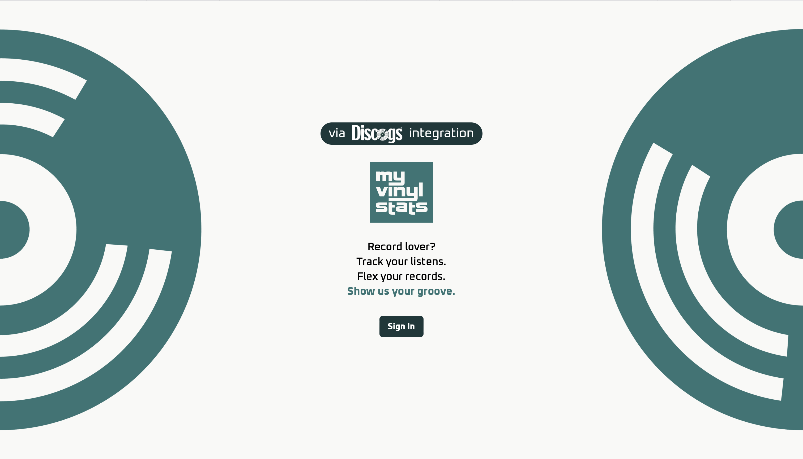
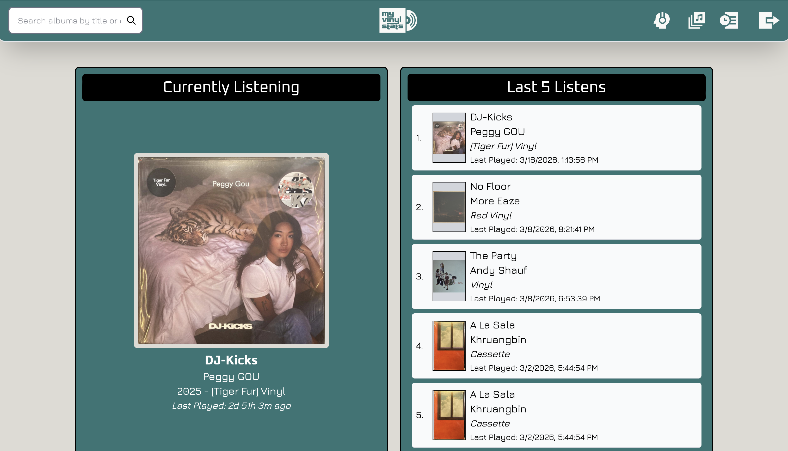

<a name="readme-top"></a>



<br />
<div align="center">
  <h3 align="center">MyVinylStats</h3>
  <p align="center">
    An interactive vinyl collection logging app — track your records, log play sessions, and explore your full listening history.
    <br />
    <a href="https://myvinylstats.com"><strong>View Live App »</strong></a>
  </p>
</div>

---

## Table of Contents

1. [About The Project](#about-the-project)
   - [Built With](#built-with)
2. [Getting Started](#getting-started)
   - [Prerequisites](#prerequisites)
   - [Installation](#installation)
3. [Usage](#usage)
4. [Architecture](#architecture)
5. [Roadmap](#roadmap)
6. [Contact](#contact)

---

## About The Project



MyVinylStats is built for vinyl collectors who want more than a static spreadsheet. It connects to your Discogs collection and lets you log every play session, building a timestamped listening history over time. The goal is a fast, repeatable logging experience — open the app, log the record, done.

**Key highlights:**
- One-action play session logging with full listening history
- Live collection data pulled from the Discogs REST API
- Secure per-user authentication via OAuth 2.0
- Production backend monitored with Prometheus & Grafana
- Fully automated deployments via GitHub Actions CI/CD

<p align="right">(<a href="#readme-top">back to top</a>)</p>

---

### Built With

[](https://reactjs.org/)
[](https://developer.mozilla.org/en-US/docs/Web/JavaScript)
[](https://nodejs.org/)
[](https://expressjs.com/)
[](https://www.mongodb.com/)
[](https://prometheus.io/)
[](https://grafana.com/)
[](https://github.com/features/actions)

<p align="right">(<a href="#readme-top">back to top</a>)</p>

---

## Getting Started

This repo contains the React frontend only. Follow the steps below to run it locally.

### Prerequisites

Install Node.js (npm is included automatically):

- Download and install from [nodejs.org](https://nodejs.org/) — use the LTS version

Verify the install worked:
```bash
node -v
npm -v
```

### Installation

1. Clone the repo
```bash
   git clone https://github.com/GFlores17/MVS-Frontend.git
   cd MVS-Frontend
```
2. Install dependencies
```bash
   npm install
```
3. Create a `.env` file in the root and add your environment variables
```
   VITE_SUPABASE_URL=your_supabase_url
   VITE_SUPABASE_ANON_KEY=your_supabase_anon_key
   VITE_BACKEND_URL=your_backend_url
```
4. Start the development server
```bash
   npm run dev
```
5. Open your browser and navigate to `http://localhost:5173`

> **Note:** Without a running backend and valid API credentials, the UI will load but data fetching will not work.

<p align="right">(<a href="#readme-top">back to top</a>)</p>

---

## Usage

- **Log a play session** — Select a record from your collection and log it in one action.
- **View listening history** — Browse your full play history sorted by date.
- **Collection sync** — Your Discogs collection stays up to date via the REST API integration.
- **Scan QR Codes** - Scan *MVS generated, persistent* QR codes tied to each album to automate the logging process.
- **Secure login** — Authenticate with your Discogs account via OAuth 2.0.

<p align="right">(<a href="#readme-top">back to top</a>)</p>

---

## Architecture

MyVinylStats is a full-stack application split across two repositories — this public frontend and a private backend.

| Layer | Technology |
|---|---|
| Frontend | React, JavaScript, HTML, CSS |
| Backend | Node.js, Express, MongoDB *(private repo)* |
| API Integration | Discogs REST API |
| Authentication | OAuth 2.0 |
| Storage | AWS S3 |
| Monitoring | Prometheus, Grafana |
| CI/CD | GitHub Actions → SSH deploy to Hostinger |

* The backend is instrumented with Prometheus to track HTTP request rates, error rates, and response times across all API endpoints.
* Grafana dashboards provide real-time observability into service health.
* Every merge to `main` or `staging` on the frontend triggers an automated GitHub Actions workflow that SSH-deploys to production.

<p align="right">(<a href="#readme-top">back to top</a>)</p>

---

## Roadmap

- [ ] Mobile-optimized UI
- [ ] More complex data dashboards (through Neo4J and GraphQL)
- [ ] Social aspects, including: profiles, friends, "grails" (your rarest records).
- [ ] iOS native mobile-app.

<p align="right">(<a href="#readme-top">back to top</a>)</p>

---

## Contact


[](https://linkedin.com/in/mvsflores)
[](https://github.com/GFlores17/)
<br/>

<p align="right">(<a href="#readme-top">back to top</a>)</p>
